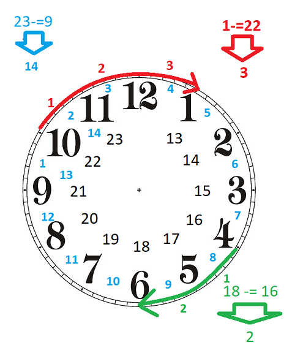
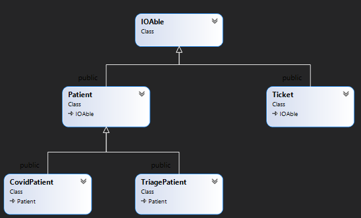

 # Project: General Hospital Pre-Triage Application
- [MS1 V1.0 due March 16th](#milestone-1)
- [MS2 V1.0 due March 22nd](#milestone-2)
- [MS3 V1.0 due March 27th](#milestone-3)
- [MS4 V1.0 due April 2nd](#milestone-4)
- [MS5 N/A]()

Because of the pandemic and prevention of the spread of COVID19, hospitals need to screen the patients and separate those in need of COVID-test from others. This has to be done in an orderly fashion by letting the patients know what is the expected wait time and let them know when they can be admitted to prevent lineups. 

Your task is to help complete the implementation of the Pre-Triage application that does the above. 

## The Pre-Triage Application
The application starts by displaying a simple menu with three options:
```Text
General Hospital Pre-Triage Application
1- Register
2- Admit
0- Exit
>
```
### Register
The register option is selected to screen patients before getting into the hospital. The user can select between a COVID Test or Triage.

COVID test is selected if the patient is at the hospital for a COVID Test. In this case, the patient's name and OHIP number are entered and then a ticket will be printed with a call number and estimated time of admission for the patient.

If Triage is selected then in addition to the patient's name and OHIP number, the symptoms of the patient are entered. Then a ticket for Triage is printed with an estimated time of admission.

### Admit
Admit is selected when the COVID Test area or the Triage section is ready to accept a patient. After selecting COVID or Triage, the patient with the next ticket in line will be called. Based on the time of the call, the average wait time for the next patient for that lineup (COVID or Triage) will be updated.

## Milestones due dates
The project will be done in 4 or 5 milestones and each milestone will have its due date. The due date of each milestone will be announced when it is published, and it is based on the amount of work to be done for that milestone. 

## Final project mark

Only the last milestone of the project is evaluated and the other milestones are to make sure you are on track and not making any irreversible mistakes. 

Although the due dates for the milestones are not firm (it is ok to be a few days early or late) but regular submission of the milestones is mandatory and holds 25% of the final mark. For example, if you submit all your milestones one week before the final due date of the project you will lose the 25% mark. 

**Your project will receive a mark of zero if all the milestones are not submitted by the rejection date stated for the milestones**

You can check the due date of each milestone using the ```-due``` flag in the submission command:
```bash
~profname.proflastname/submit 2??/prj/m? -due
```
- replace **2??** with the subject code
- replace **m?** with the milestone number

## Citation, Sources

When submitting your work, all the files submitted should carry full student information along with the "citation and sources" information. See the following example:

```C++
/* Citation and Sources...
Final Project Milestone ? 
Module: Whatever
Filename: Whatever.cpp
Version 1.0
Author	John Doe
Revision History
-----------------------------------------------------------
Date      Reason
2020/?/?  Preliminary release
2020/?/?  Debugged DMA
-----------------------------------------------------------
I have done all the coding by myself and only copied the code 
that my professor provided to complete my workshops and assignments.
-----------------------------------------------------------
OR
-----------------------------------------------------------
Write exactly which part of the code is given to you as help and 
who gave it to you, or from what source you acquired it.
-----------------------------------------------------------*/
```

## Compiling and Testing Your Program

All your code should be compiled using this command on `matrix`:

```bash
g++ -Wall -std=c++11 -g -o ws file1.cpp file2.cpp ...
```

- `-Wall`: the compiler will report all warnings
- `-std=c++11`: the code will be compiled using the C++11 standard
- `-g`: the executable file will contain debugging symbols, allowing *valgrind* to create better reports
- `-o ws`: the compiled application will be named `ws`

After compiling and testing your code, run your program as following to check for possible memory leaks (assuming your executable name is `ws`):

```bash
valgrind ws
```

To check the output, use a program that can compare text files.  Search online for such a program for your platform, or use *diff* available on `matrix`.

> Note: All the code written in the project must be implemented in the **sdds** namespace.

## Project Implementation notes:  *Very Important, read carefully*
-	All the code written in this project should be within the namespace sdds.
-	You are free and encouraged to add any member variables, functions and member functions you find necessary to complete your code. If you are not sure about your strategy for adding functionalities and properties to your classes, ask your professor for advice.  
-	A module called **utils** is added to the project with one function that can be used in your implementation. You can add any custom code of your own to the **utils** module to be used throughout the project. Also, because the application works with real system time, for debugging purposes a global **sdds::debug** flag is added to the utils module. (see utils and Time module for more information)<br/>
You could use this flag for your own debugging messages also.  **utils.h** will be included in all the unit tests of the milestones. 
> Note that all the debugging code and debugging comments must be removed before submission.

-	Unless you are asked for a specific definition, name the variables, and functions yourself. Use proper names and follow the naming conventions instructed by your professor. Having meaningless and misleading names will attract a penalty.

-	Throughout the project, if any class is capable of displaying or writing itself, the member function will always have the following signature: 
The function will return a reference of an **ostream** and will receive a reference of an "ostream" as an argument.  
-	Throughout the project, if any class is capable of reading or receiving its content from a stream, the member function will always have the following signature: 
The function will return a reference of an **istream** and will receive a reference on an **istream** as an argument.  
-	When creating methods (member functions) make sure to make them constant if in their logic, they are not modifying their class.
-	When passing an object or variable by address or reference, if they are not to be modified, make sure they are passed as constant pointers and references.
-	If an Empty state is required for an object, it is considered to be an “invalid” empty state, and objects in this state should be rendered unusable.

# Milestone 1 

## utils Module
### getInt()
Add the following functions to the utils module:
```C++
int getInt(
   const char* prompt = nullptr   // User entry prompt
);
```
This function performs a fool-proof integer entry from the console. 

If the prompt is not null, it is displayed before the entry as a prompt (only once).

If the user enters an invalid integer, the message ```"Bad integer value, try again: "``` is displayed until the user enters a valid integer value.

If after a valid integer value any character other than a **New Line** is entered, then the message ```"Enter only an integer, try again: "``` is displayed until the user enters only an integer value at the entry.

The entered value is returned at the end.

```C++
int getInt(
   int min,   // minimum acceptable value
   int max,   // maximum acceptable value
   const char* prompt = nullptr,  // User entry prompt
   const char* errorMessage = nullptr, // Invalid value error message
   bool showRangeAtError = true    // display the range if invalud value entered 
);
```
This function performs a fool-proof integer entry from the console. 

This function works exactly like the previous getInt function with the following additional features.

The range of the valid entry is checked after a valid integer is received.

If the value is out of the range specified by the **min** and **max** arguments, the function will keep trying to get a proper value until the user enters it correctly. 

After each invalid entry, the errorMessage is displayed only if the errorMessage is not null.

After each invalid entry, the range of valid entry is displayed in the following format only if the showRangeAtError argument is true:
```Text
"[MM <= value <= XX]"
```
- MM is replaced with the min argument value
- XX is replaced with the max argument value

### getInt unit test
```C++
void getIntTester() {
   cout << "getInt tester:" << endl;

   cout << "Enter 11: ";
   cout << getInt() << endl << endl;

   cout << "Enter the following values at the prompt: " << endl;
   cout << "abc<ENTER>" << endl;
   cout << "9abc<ENTER>" << endl;
   cout << "9 <ENTER> (there is a space after 9)" << endl;
   cout << "9<ENTER>" << endl;
   cout << getInt("> ") << endl << endl;

   cout << "Enter the following values at the prompt: " << endl;
   cout << "abc<ENTER>" << endl;
   cout << "9<ENTER>" << endl;
   cout << "10<ENTER>" << endl;
   cout << "21<ENTER>" << endl;
   cout << "21 <ENTER> (there is a space after 21)" << endl;
   cout << "20<ENTER>" << endl;
   getInt(10, 20, "> ", "Value must be between 10 and 20: ", false);
   cout << "last value entered: " << getInt(10, 20, "> ", "Invalid value, retry ") << endl;
}
```
#### getIntTester output
```Text
getInt tester:
Enter 11: 11
11

Enter the following values at the prompt:
abc<ENTER>
9abc<ENTER>
9 <ENTER> (there is a space after 9)
9<ENTER>
> abc
Bad integer value, try again: 9abc
Enter only an integer, try again: 9
Enter only an integer, try again: 9
9

Enter the following values at the prompt:
abc<ENTER>
9<ENTER>
10<ENTER>
21<ENTER>
21 <ENTER> (there is a space after 21)
20<ENTER>
> abc
Bad integer value, try again: 9
Value must be between 10 and 20: 10
> 21
Invalid value, retry [10 <= value <= 20]: 21
Enter only an integer, try again: 20
last value entered: 20

```
### getcstr()
```C++
char* getcstr(
   const char* prompt = nullptr,   // User entry prompt
   std::istream& istr = std::cin,  // the Stream to read from
   char delimiter = '\n'    // Delimiter to mark the end of data
);

```
Prompts the user for the entry if the prompt argument is not null. 

Receives an unknown size string from the istream object and allocates a dynamic Cstring to the size of the string and copies the value of the string into it. (Make sure null termination is put into account when setting the size)

In the end, it will return the dynamically allocated memory. 

> Optional Challenge: Implement this without using the C++ **string** class. (Make sure to notify your professor of the implementation in your final project reflection)

#### getcstr unit test

```C++
void getcstrTester() {
   char* cstr;
   cout << "Copy and past the following at the prompt:" << endl;
   cout << "If you didn't care what happened to me, "
      "And I didn't care for you, "
      "We would zig zag our way through the boredom and pain, "
      "Occasionally glancing up through the rain. "
      "Wondering which of the brothers to blame. "
      "And watching for pigs on the wing." << endl;
   cstr = getcstr("Paste here /> ");
   cout << cstr << endl;
   delete[] cstr;
}
```
#### getcstrTester output
```Text
Copy and paste the following at the prompt:
If you didn't care what happened to me, And I didn't care for you, We would zig zag our way through the boredom and pain, Occasionally glancing up through the rain. Wondering which of the brothers to blame. And watching for pigs on the wing.
Paste here /> If you didn't care what happened to me, And I didn't care for you, We would zig zag our way through the boredom and pain, Occasionally glancing up through the rain. Wondering which of the brothers to blame. And watching for pigs on the wing.
you entered:
If you didn't care what happened to me, And I didn't care for you, We would zig zag our way through the boredom and pain, Occasionally glancing up through the rain. Wondering which of the brothers to blame. And watching for pigs on the wing.
```

## Time Module
The time module is designed to:
- read and write time values.
- measure the passage of time by doing basic arithmetic operations

The time module only holds the time in minutes but will display and read the time in the following format:  

```Text
HH:MM
```
For example, when the Time object holds the value 125, it will display **02:05**. Likewise if the time **13:55** is read by the Time object from a stream, **835** is stored in the object (i.e. 13x60+55). Note that since the Time object is also used for the passage of time, there is no limit to the number of hours and minutes and they may pass 24 and 60  if needed.  
> Note: **125:15** is a valid time that means **125** hours and **15** minutes also **0:96** is a valid entry and it is displayed as: **01:36** that is **1** hour and **36** minutes

Complete the implementation of the Time class with the following mandatory specs:  

```C++
namespace sdds {
   class Time {
      unsigned int m_minutes;
   public:
      Time& setToNow();
      Time(unsigned int minutes = 0);
      std::ostream& write(std::ostream& ostr) const;
      std::istream& read(std::istream& istr);

      Time& operator-=(const Time& D);
      Time operator-(const Time& D)const;
      Time& operator+=(const Time& D);
      Time operator+(const Time& D)const;

      Time& operator=(unsigned int val);
      Time& operator *= (unsigned int val);
      Time& operator /= (unsigned int val);
      Time operator *(unsigned int val)const;
      Time operator /(unsigned int val)const;

      operator unsigned int()const;
      operator int()const;
   };
```
```C++
Time& setToNow();  
```
setToNow, sets the **Time** to the current time using **sdds::getTime()** (available in **utils** module) and then returns the reference of the current object.

> Note that if the **sdds::debug** is set to true, the **getTime()** function will receive the time from the user instead. This will be used for debugging purposes and when submitting your work through the submitter program.

### Time::Time

```C++
Time(unsigned int min = 0); 
```
Constructs the Time by setting the number of minutes held in the object or set the time to zero by default.

### Time::write

```C++
std::ostream& write(std::ostream& ostr) const;
```

Writes the time into a stream in HH:MM format padding the spaces with zero if
the numbers are single digit (examples   03:02, 16:55  234:06 )

### Time::read

```C++
std::istream& read(std::istream& istr);
```

Reads the time from a stream in H:M format. It makes sure that the two integers (hours and minute) are greater than zero and separated by ":", otherwise it will set the **istream** object to a [failure state](#setting-istream-to-a-fail-state). 

This function does not react to any invalid data, instead, it will work exactly how istream works; *It will put the istream in a failure state if anything goes wrong* by following these steps:

- reads the integer for the hours using **istr** and if the value is negative, it sets [the istream object to a failure state](#setting-istream-to-a-fail-state).
- reads one character and makes sure it is **':'**. If it is not **':'**, it will set [the istream object to a failure state](#setting-istream-to-a-fail-state).
- reads the integer for the minutes using **istr** and if the value is negative, it [sets the istream object to a failure state](#setting-istream-to-a-fail-state).

#### setting istream to a fail state
To set the istream to a fail state manually call the following method of istream:

```C++
setstate(ios::failbit);
```

> Note: Do not clear or flush the **istream** object since this method complies with the **istream** standards. The caller of this function may check the state of the **istream** object to make sure that the read was successful if needed.

### Time basic arithmetic operations

All the implemented basic arithmetic operations on **Time** are done exactly as it is defined in math except for the subtraction: 

### Time::operator-=
Design the subtraction in the **Time** as if you are turning a 24-hour clock backwards:

```C++
Time& operator-= (const Time& D);
```
Calculates the time difference between the current time and the incoming argument Time **D** and the returns the reference of the left operand object. Note that the difference can never be a negative value:<br/>
23:00 -= 9:00 will be **14:00**.<br />
18:00 -= 16:00 will be **2:00**.<br />
1:00 -= 22:00 will be **3:00**.  ((**1:00** + 24:00) - **22:00**)<br /> 
Also:<br />
1:00 -= 46:00 will be **3:00**. ((**1:00** + 24:00 + 24:00) - **46:00**)<br /> 
See the illustration below:



### Time::operator-

```C++
Time operator-(const Time& D)const;
```
Works exactly like the operator-= but without side-effect. This operator will not modify the left operand and returns a **Time** object that is the result of the calculation.

### Time::operator+=
```C++
Time& operator+=(const Time& D);
```
Add the minute value of the right operand to the value of the left operand and then returns the reference of the left operand.


### Time::operator+
```C++
Time operator+(const Time& D)const;
```
Creates a Time object with the minute value that is the sum of the minute values of the left and right operands and then returns it.


### Time::operator=

```C++
Time& operator=(unsigned int val);
```
Sets the minute value of the left operand to the value of the right operand and then returns the reference of the left operand. 

### Time::operator*=

```C++
Time& operator *= (unsigned int val);
```
Multiplies the minutes' value of the left operand by the value of the right operand and then returns the reference of the left operand. 

### Time::operator*

```C++
Time operator *(unsigned int val)const;
```
Creates a **Time** object with the minutes value being the product of the minutes' value of the left operand by the value of the right operand and returns the object.

### Time::operator/=

```C++
Time& operator /= (unsigned int val);
```
Divides the minutes' value of the left operand by the value of the right operand and then returns the reference of the left operand. 

### Time::operator/

```C++
Time operator /(unsigned int val)const;
```

Creates a **Time** object with the minutes value being the division of the minutes' value of the left operand by the value of the right operand and returns the object.


### Time::operator int

```C++
operator int()const;
```
When the time is cast to an integer, it will return the number of minutes as an integer.

### Time::operator unsigned int

```C++
operator unsigned int()const;
```
When the time is cast to an unsigned integer, it will return the number of minutes.


```C++
operator<<
```
Overload the insertion operator to be able to insert a Time object into an ostream object 
```C++
operator>>
```
Overload the extraction operator to be able to extract data from an istream object into the Time object

### Time unit test
```C++
void timeTester() {
   Time D(1385u), C(65u), E;
   cout << "E: " << E << endl;
   cout << "D: " << D << endl;
   cout << "C: " << C << endl;

   cout << "  D        C     D-=C" << endl;
   cout << D << " -= " << C << " = ";
   cout << (D -= C) << endl << endl;

   cout << "  C        D     C-=D" << endl;
   cout << C << " -= " << D << " = ";
   cout << (C -= D) << endl << endl;

   cout << "  C        D     C+=D" << endl;
   cout << C << " += " << D << " = ";
   cout << (C += D) << endl << endl;

   cout << " C = 245u" << endl;
   cout << "C: " << (C = 245u) << endl << endl;

   cout << " D = 2760u" << endl;
   cout << "D: " << (D = 2760u) << endl << endl;

   cout << "  E   =   C   +   D" << endl;
   E = C + D;
   cout << E << " = " << C << " + " << D << endl << endl;

   cout << "  E   =   C   -   D" << endl;
   E = C - D;
   cout << E << " = " << C << " - " << D << endl << endl;

   cout << "C: " << C << endl;
   cout << " C *= 2u;" << endl << "C: ";
   cout << (C *= 2u) << endl;
   cout << " C *= 12u" << endl << "C: ";
   cout << (C *= 12u) << endl << endl;

   cout << " C = 245u" << endl;
   cout << "C: " << (C = 245u) << endl << endl;

   cout << "  E   =   C   *  2u" << endl;
   E = C * 2u;
   cout << E << " = " << C << " *  2u" << endl << endl;
   cout << "  E   =   C   *  12u" << endl;
   E = C * 12u;
   cout << E << " = " << C << " *  12u" << endl << endl;

   cout << "C: " << C << endl;
   cout << " C /= 2u;" << endl << "C: ";
   cout << (C /= 2u) << endl;

   cout << " C = 245u" << endl;
   cout << "C: " << (C = 245u) << endl << endl;

   cout << "  E   =   C   /  2u" << endl;
   E = C / 2u;
   cout << E << " = " << C << " /  2u" << endl << endl;

   cout << "E: " << E << endl;
   cout << "D: " << D << endl;
   cout << "C: " << C << endl << endl;

   cout << "Enter the following values at the prompt:" << endl;
   cout << "aa:bb<ENTER>" << endl;
   cout << "12,12<ENTER>" << endl;
   cout << "-12:12<ENTER>" << endl;
   cout << "12:-12" << endl;
   cout << "12:12" << endl;

   cout << "Please enter the time (HH:MM): ";
   bool done;
   do {
      done = true;
      cin >> E;
      if (cin.fail()) {
         cin.clear();
         cin.ignore(1000, '\n');
         done = false;
         cout << "Bad time entry, retry (HH:MM): ";
      }
   } while (!done);
   cout << "you entered: " << E << endl << endl;
   cout << "Enter 100:100 at the prompt: " << endl;
   sdds::debug = true;
   E.setToNow();
   cout << E << endl;
   sdds::debug = false;
   cout << "The actual system time is: " << Time().setToNow() << endl;
}
```
#### Time unit test output
```Text
E: 00:00
D: 23:05
C: 01:05
  D        C     D-=C
23:05 -= 01:05 = 22:00

  C        D     C-=D
01:05 -= 22:00 = 03:05

  C        D     C+=D
03:05 += 22:00 = 25:05

 C = 245u
C: 04:05

 D = 2760u
D: 46:00

  E   =   C   +   D
50:05 = 04:05 + 46:00

  E   =   C   -   D
06:05 = 04:05 - 46:00

C: 04:05
 C *= 2u;
C: 08:10
 C *= 12u
C: 98:00

 C = 245u
C: 04:05

  E   =   C   *  2u
08:10 = 04:05 *  2u

  E   =   C   *  12u
49:00 = 04:05 *  12u

C: 04:05
 C /= 2u;
C: 02:02
 C = 245u
C: 04:05

  E   =   C   /  2u
02:02 = 04:05 /  2u

E: 02:02
D: 46:00
C: 04:05

Enter the following values at the prompt:
aa:bb<ENTER>
12,12<ENTER>
-12:12<ENTER>
12:-12
12:12
Please enter the time (HH:MM): aa:bb
Bad time entry, retry (HH:MM): 12,12
Bad time entry, retry (HH:MM): -12:12
Bad time entry, retry (HH:MM): 12:-12
Bad time entry, retry (HH:MM): 12:12
you entered: 12:12

Enter 100:100 at the prompt:
Enter current time: 100:100
101:40
The actual system time is: 11:46
```
> Note: the last value **11:46** changes based on the system's time.

## MS1 Submission and the due date
Milestone 1 suggested due date is on March 16th.

> If you would like to successfully complete the project and be on time, try to meet all the due dates of the milestones.


Upload your source code and the tester program (**utils.cpp, utils.h, Time.cpp, Time.h and ms1Tester.cpp**) to your `matrix` account. Compile and run your code using the `g++` compiler as shown above and make sure that everything works properly.

Then, run the following command from your account (replace `profname.proflastname` with your professor’s Seneca userid):
```
~profname.proflastname/submit 2??/prj/m1
```
and follow the instructions.

- *2??* is replaced with your subject code

# Milestone 2
## Menu Module
Menu class encapsulates a menu and provides selection functionality for the caller program.

```C++
 class Menu{
      char* m_text; // holds the menu content dynamically
      int m_noOfSel;  // holds the number of options displayed in menu content
      void display()const;
   public:
      Menu(const char* MenuContent, int NoOfSelections);
      virtual ~Menu();
      int& operator>>(int& Selection);
      // add safe copying logic
   };
```

```C++
 Menu(const char* MenuContent, int NoOfSelections);
```
Dynamically allocates memory to hold the content pointed by **m_text**. Also keeps the number of Selections in **m_noOfSel**.
```C++
 ~Menu();
```
Deallocates the dynamically allocated memory.
```Text
Copy and assignment
```
Make sure the Menu can be safely copied but **not** be able to be assigned to another Menu object.
```Text
display
```
Displays the Menu content and then in a new line, it displays:

```Text
0- Exit
<NEWLINE>
```
```C++
int& operator>>(int& Selection);
```
The member insertion operator first calls the display function and then receives the user's selection as an integer value using the **getInt()** function in **utils** module. The integer reference **selection** argument is then set to this value and returned.<br />
Make sure that the entered value is validated as an integer and also the value should be between 0 and **m_noOfSel**.<br />
If the above conditions are not met, a proper error message should be displayed and re-entry requested(see below)

Assuming that the menu content is set to:```"Tester Options menu:\n1- Option one\n2- Option two\n3- Option three"``` and the number of selections is set to 3 the **operator>>** should run like this:
```Text
Tester Options menu:
1- Option one
2- Option two
3- Option three
0- Exit
> -1
Invalid option [0 <= value <= 3]: 4
Invalid option [0 <= value <= 3]: 2
```

## Menu Tester program execution sample (menuTester.cpp)
```Text
Tester Options menu:
1- Option one
2- Option two
3- Option three
0- Exit
> -1
Invalid option [0 <= value <= 3]: 4
Invalid option [0 <= value <= 3]: abc
Bad integer value, try again: 2
option two selected

Tester Options menu:
1- Option one
2- Option two
3- Option three
0- Exit
> 1
option one selected

Tester Options menu:
1- Option one
2- Option two
3- Option three
0- Exit
> 3
option three selected

Tester Options menu:
1- Option one
2- Option two
3- Option three
0- Exit
> 0
goodbye!
```

## IOAble interface module

In milestone 1 we have created the utility classes and Time display and calculations.<br />
Now we need to start to create the core classes of the application.  The diagram below displays the core classes of the application and their relationship.



Create a class called **IOAble**.  This class is an interface and enforces input and output methods to its derived classes.<br />
The IOAble class has only 4 pure virtual functions and a virtual empty destructor.

## Pure Virtual Functions:
### csvWrite
This pure virtual function is for future comma-separated ostream outputs.
It receives a reference of an ostream and returns a reference of an ostream. This function is incapable of changing the current object.  
### csvRead
This pure virtual function is for future comma-separated istream input.
It receives a reference of an istream and returns a reference of an istream.
### write
This pure virtual function is for future ostream outputs.
It receives a reference of an ostream and returns a reference of an ostream. This function is incapable of changing the current object.
### read
This pure virtual function is for future istream inputs.
It receives a reference of istream and returns a reference of an istream.
### virtual destructor
This class also has an empty virtual destructor.

## Insertion and Extraction helper operator overloads.
### operator<<
Overload the insertion operator to be able to insert the information of an IOAble object into ostream using the IOAble::write function.
### operator>>
Overload the extraction operator to be able to extract information from an istream into an IOAble object using the IOAble::read function.

## The IOAble tester program. (IOAbleTester.cpp)
Read and study the tester program and understand how it works.  It is a very good example to show how an interface is used as a base class.  It also can help you in the development of the upcoming milestones.

## IOAbleTester.cpp Execution Sample 
> Use these data entries for your submission.
```Text
defaulting Box
Getting information of an IOAble box from console:
Height: 5
Width: 25
Display the IOAble box on console:
**************************************************
**************************************************
**************************************************
**************************************************
**************************************************

Saving 5,25 in the output file.
Dynamically allocating a Box and holding it in an IOAble pointer...
defaulting Box
Reading dimenstions from file using the IOAlbe pointer
Dimentions:
5,7
What it looks like on screen:
**************
**************
**************
**************
**************

Now save it in the file...
Reading the next dimenstions from file using the IOAble pointer
Dimentions:
7,4
What it looks like on screen:
********
********
********
********
********
********
********

Save this one in the output file too...
Close the file and display it...
boxesOut.txt---------------------
5,25
5,7
7,4
---------------------------------
Removing the box from memory using the IOAble pointer...
Box(7,4) is gone!
Content of "boxesOut.txt" file
boxesOut.txt---------------------
5,25
5,7
7,4
---------------------------------
Box(5,25) is gone!

```

## ms2Tester program

The MS2 Tester program is a combined prgraom of the Menu Tester and the IOAble Tester programs.

Use the same data in the two tester programs for your submission.

## MS2 Submission and the due date
Milestone 2 suggested due date is on March 22nd.

> If you would like to successfully complete the project and be on time, try to meet all the due dates of the milestones.

### MS2 Files for submission
``` Text
boxes.txt
Menu.cpp
Menu.h
IOAble.cpp
IOAble.h
utils.cpp
utils.h
Time.cpp  // not used in this milestone, but needed for uitls to compile
Time.h    // same as above
ms2Tester.cpp
```

Upload your source code and the tester program to your `matrix` account. Compile and run your code using the `g++` compiler as shown before and make sure that everything works properly.

Then, run the following command from your account (replace `profname.proflastname` with your professor’s Seneca userid):
```
~profname.proflastname/submit 2??/prj/m2
```
and follow the instructions.

- *2??* is replaced with your subject code

# Milestone 3

## The Ticket Module (implementation provided)

The Ticket class encapsulates a Ticket to be given to the patients when they arrive. Read the code, understand it, and use the logic and the functionalities throughout the project. 

```C++
#ifndef SDDS_TICKET_H_
#define SDDS_TICKET_H_
#include "Time.h"
#include "IOAble.h"
namespace sdds {
   class Ticket:public IOAble{
      Time m_time;  
      int m_number;
   public:
      Ticket(int number);
      operator Time()const;
      int number()const;
      void resetTime();
      std::ostream& csvWrite(std::ostream& ostr)const;
      std::istream& csvRead(std::istream& istr);
      std::ostream& write(std::ostream& ostr )const;
      std::istream& read(std::istream& istr);
   };
}
#endif // !SDDS_TICKET_H_
```
### Member Variables
#### Time m_time;
The time the Ticket was issued
#### int m_Number;
The ticket number; A sequential integer, starting from one and unique for each lineup.
### Member functions and constructor
#### Ticket(int number);
Constructs a Ticket by setting the **m_number** member variable
#### operator Time()const;
When Ticket is casted to **Time** it will return the **m_time**
#### int number()const;
A query returning the number of the ticket
#### void resetTime();
Sets the Ticket time to the current time.
### Virtual function overrides
#### csvWrite
Inserts comma-separated ticket number and time into ostream.
#### csvRead
Extracts the ticket number and time in a comma-separated format from istream.
#### write
Inserts a ticket into the ostream to be displayed on the console.
#### read
Extracts the ticket information from istream.  This function works the same as csvRead. 

## The Patient Module

Create an abstract IOAble patient class (the patient class is a derived class from IOAble).  The patient class is responsible to encapsulate a general patient arriving at the hospital.  In later designs (MS4) the patient class will be inherited into a COVID test patient and a triage patient.  

The following are the mandatory properties of the patient class.

### Member Variables and Objects
#### the patient name
A character pointer variable to hold the name of the patient in a Cstring dynamically.
#### the OHIP number
An integer to hold the OHIP insurance number (exactly 9 digits) of the patient.
#### the ticket
A **Ticket** object to hold the ticket of the patient for the lineup.
#### the file IO flag
A Boolean flag. This flag will be set to **true** if the patient object is to be written into or read from a **file** (comma separated value), otherwise, this flag will be set to **false** if the patient object is to be written on or read from the **console**.

### Constructor and destructor
A patient can be instantiated using a ticket number (an integer) and a file IO flag (a Boolean).  The ticket number is used to initialize the member [ticket object](#the-ticket). The file IO is used to initialize the member [file IO flag](#the-file-io-flag). 

When a patient has instantiated it, If the file IO flag is not provided the default value **"false"** is passed also if the ticket number is not provided the default value **zero (0)** is passed.

### Copying and assignment.
A patient cannot be copied or assigned to another patient; 

### Destructor
The destructor of the patient will deallocate the dynamically allocated [patient name Cstring](#the-patient-name).

### Member functions
#### Pure Virtual Function type()
Create a pure virtual function called **type** that returns a character and is incapable of modifying the current object.
In future derived objects, this function will return a single character that identifies the type of the patient (COVID test patient or Triage patient).

#### FileIO query and modifier
##### fileIO query
Create a query called fileIO that returns the member [file IO flag](#the-file-io-flag).  This query is incapable of modifying the current object.
##### fileIO modifier
Create a modifier member function called fileIO that receives a Boolean value to set the member [fileIO flag](#the-file-io-flag).

#### operator== overloads
##### character comparison
Overload the operator== to compare the current object with an incoming single character and return true if the single character is the same as the return value of [the pure virtual type member function](#pure-virtual-function-type).  This operator receives a single character and returns true or false and can not modify the current object.
##### comparing to another patient
Overload the operator to compare the current object to another patient and return true if the type of the current patient is the same as the type of the other patient.
This operator receives a constant reference of a patient object, and returns true or false, and can not modify the current object.

#### setArrivalTime function
Sets the time of the ticket of the patient to the current time.
This function neither receives nor returns any value.

#### Time cast operator overload
If the patient is casted to the Time type it should return the time of the ticket.
This cast overload can not modify the current object.

#### number
Create a query function called **number** that returns the number of the ticket.
This function can not modify the current object.

### pure virtual function overwrites.
#### csvWrite
Inserts the following values into the ostream in a comma-separated format.  After the values are inserted it will insert a single "comma", and then call the csvWrite function of the member [ticket object](#the-ticket) and return the ostream.

Here is the sequence of the values inserted into ostream
```Text
returned value of type() function
','
name of the patient
','
OHIP number
','
```
then it will call the csvWrite function of the member [ticket object](#the-ticket).

#### csvRead
The csvRead function extracts all the values in the same order as the csvWrite function, except for the type.<br />
- Start with the extraction with the name of the patient up to the comma (**','**) character and dynamically hold it in "[the patient name pointer](#the-patient-name)", dicarding the comma (**','**) delimiter . *Make sure that [the name pointer](#the-patient-name) is deleted before the allocation to guarantee there is no memory leak.* 
- then extract an integer from istream into the OHIP member variable.
- discard the delimeter 
- Finally, end the extraction by calling the csvRead of the member [ticket object](#the-ticket).
- return the istream reference at the end.

#### write
Inserts the patient information into the ostream to be displayed on the console.
- insert  the member [ticket object](#the-ticket into ostream
- go to newline
- insert the name up to 25 character (ingnore the rest if more that 25 characters)
- insert ```", OHIP: "```
- insert the OHIP number number
- return the ostream

#### read
Extracts the ticket information from the console using istream as follows:
- Prompt: ```"Name: "```
- Extract the name of the patient up to the newline (**'\n'**) character and dynamically hold it in "[the patient name pointer](#the-patient-name)", dicarding the newline(**'\n'**) delimiter . *Make sure that [the name pointer](#the-patient-name) is deleted before the allocation to guarantee there is no memory leak.* 
- Prompt: ```"OHIP: "```
- Extract the 9 digit OHIP number from istream; validate it and make sure it is 9 digits. 
- return the istream reference at the end.

Execution example:  
```Text
Name: John Doe
OHIP: abc
Bad integer value, try again: 100
Invalid OHIP Number, [100000000 <= value <= 999999999]: 123123123
```

## The tester program.
Read and study the tester program and understand how it works. 

## ms3Tester.cpp Execution Sample 

```Text
Enter The following:
-------------------
John Doe
abc
100
123123123
12:34
-------------------
Name: John Doe
OHIP: abc
Bad integer value, try again: 100
Invalid OHIP Number, [100000000 <= value <= 999999999]: 123123123
Enter current time: 12:34
Sections 1 and 2 should match:

1- Your output on screen:
Ticket No: 24, Issued at: 12:34
John Doe, OHIP: 123123123
2- The output should be :
Ticket No: 24, Issued at: 12:34
John Doe, OHIP: 123123123

1- Your comma separated ouput:
W,John Doe,123123123,24,12:34
2- comma separated ouput should be:
W,John Doe,123123123,24,12:34

Enter the following:
>Jo Lee,234234234,200,12:50
>Jo Lee,234234234,200,12:50
Sections 1 and 2 should match:

1- Your output on screen:
Ticket No: 200, Issued at: 12:50
Jo Lee, OHIP: 234234234
2- The output should be:
Ticket No: 200, Issued at: 12:50
Jo Lee, OHIP: 234234234

Testing File IO:
1 -----------------------------------------------
Ticket No: 10, Issued at: 12:50
David Mason, OHIP: 111111111

2 -----------------------------------------------
Ticket No: 11, Issued at: 12:51
Nick Gilmour, OHIP: 222222222

3 -----------------------------------------------
Ticket No: 12, Issued at: 12:52
Roger Wright, OHIP: 333333333

4 -----------------------------------------------
Ticket No: 13, Issued at: 12:53
Rick Waters, OHIP: 333333333

5 -----------------------------------------------
Ticket No: 14, Issued at: 12:54
A name that is way way wa, OHIP: 444444444

ms3out.csv-----------------------
W,David Mason,111111111,10,12:50
W,Nick Gilmour,222222222,11,12:51
W,Roger Wright,333333333,12,12:52
W,Rick Waters,333333333,13,12:53
W,A name that is way way way way way way way way too long,444444444,14,12:54
---------------------------------
Testing operator== overloads:
Success!
Success!
Testing Time cast and number:
Sections 1 and 2 should match:

1- Your output on screen:
W, Ticket Time: 12:54
W, Ticket number: 14
2- The output should be:
W, Ticket Time: 12:54
W, Ticket number : 14

```


## MS3 Submission and the due date
Milestone 3 suggested due date is on March 27th.

> If you would like to successfully complete the project and be on time, try to meet all the due dates of the milestones.

### Files for submission
``` Text
ms3.csv
IOAble.cpp
IOAble.h
utils.cpp
utils.h
Time.cpp  
Time.h    
Ticket.cpp
Ticket.h
Patient.cpp
Patient.h
ms3Tester.cpp
```

Upload your source code and the tester program to your `matrix` account. Compile and run your code using the `g++` compiler as shown before and make sure that everything works properly.

Then, run the following command from your account (replace `profname.proflastname` with your professor’s Seneca userid):
```
~profname.proflastname/submit 2??/prj/m3
replace ?? with yoru subject code (44 or 00)
```
and follow the instructions.


# Milestone 4
> Note that you may have to modify or correct some of your implementations done in previous milestones, even though you passed the previous (milestones) testers successfully. This is a natural course of developing an application. There is no need to notify your professor about this unless you would like to get advice on the matter. 

Continue the implementation of the Pre-triage application by implementing the COVID patient and the triage patient modules. 

## The CovidPatient module
This module has one integer global variable called **nextCovidTicket** that is initialized to **one**.  This global variable will be used to determine what is the ticket number of the next COVID test Patient.  Each time a new **CovidPatient** object is created the value of the **nextCovidTicket** will be increased by **one**.  The scope of the global **nextCovidTicket** variable is only the **CovidPatient** module to make sure that the ticket numbers of Covid patients are kept separate from the Triage patients.

The **CovidPatient** class is publicly derived from the **Patient** class. The **CovidPatient** class does not add any member variables or properties to the **Patient** module.

The **CovidPatient** class has one **default constructor**, implements the pure virtual **type()** function and re-implements the two **read** functions and the **write** fucniton of the base class **Patient** as follows:

### Default Constructor
Sets the Ticket number to the current global value and then increases the global value by one.
#### implementation
The default constructor passes the **nextCovidTicket** global variable to the **constructor** of the base class **Patient** and then it will increase the value of **nextCovidTicket** global variable by **one**.

### The type() virtual function
Identifies the Patient object as a Covid patient by returning the letter **C**.
#### implementation
This function only returns the character **'C'**;

### csvRead virtual function override
Reads a comma-separated record of a Patient and sets the global ticket number to the next number after the Patient's ticket number.
#### implementation
First this function will call the **csvRead** function of the base class **Patient**, afterwards it will set the **nextCovidTicket** global variable to the return value of the **number()** function of the **Patient** class plus **one**. 
Then it will ignore the terminating **'\n'** character.
Finally, it will return the istream reference.

### write virtual function override.
Based on the return value of the **fileIO** method it will either write the patient in a comma-separated format or a descriptive format for screen or ticket. 
#### implementation
If the **fileIO** member function returns **true**, it will call the **csvWrite** function of the base class, otherwise it will first insert **"COVID TEST"** into the **ostream** object and goes to **newline**. Then it will call the **write()** function of the base class and then goes to **newline**.

Then it will end the function by returning the **ostream** reference.

### read virtual function override. 
Based on the return value of the **fileIO** method it will either read the patient in a comma-separated format from istream or perform a fool-proof entry from the console.
#### implementation
If the **fileIO** member function returns true it will call the **csvRead** function, otherwise, it will call the read function of the base class.

Then it will end the function by returning the **istream** reference.

### Destructor
This class does not need a destructor.

## the CovidPatient Tester (CPTester.cpp) output
```Text
Testing CovidPatient:
Enter the following:
Enter current time: 12:34
Name: aaa
OHIP: 111111111
Enter current time: 12:34
Enter Patient information:
Name: aaa
OHIP: 111111111
Enter the following:
Enter current time: 12:35
Name: bbb
OHIP: 222222222
Enter current time: 12:35
Enter Patient information:
Name: bbb
OHIP: 222222222

Patients information entered:
COVID TEST
Ticket No: 1, Issued at: 12:34
aaa, OHIP: 111111111

COVID TEST
Ticket No: 2, Issued at: 12:35
bbb, OHIP: 222222222

CSV output:
C,aaa,111111111,1,12:34
C,bbb,222222222,2,12:35

Testing CSV input:
Enter the following:
>ccc,333333333,10,23:45
>ccc,333333333,10,23:45

Data entered:
COVID TEST
Ticket No: 10, Issued at: 23:45
ccc, OHIP: 333333333

Testing global ticket number variable:
Enter the following:
Enter current time: 23:55
Name: ddd
OHIP: 444444444
Enter current time: 23:55
Name: ddd
OHIP: 444444444
Patient information entered:
COVID TEST
Ticket No: 11, Issued at: 23:55
ddd, OHIP: 444444444
```

## The TriagePatient Module
This module has one integer global variable called **nextTriageTicket** that is initialized to **one**.  This global variable will be used to determine what is the ticket number of the next triage Patient.  Each time a new **TriagePatient** is created the value of the **nextTriageTicket** will be increased by **one**.  The scope of the global **nextTriageTicket** variable is only the TriagePatient module.

The **TriagePatient** class is publicly derived from the **Patient** class. The **TriagePatient** class adds only one character pointer member variable to the **Patient** module to dynamically hold the symptoms of the arriving patient for the triage centre.

The **TriagePatient** class has one **default constructor**, implements the pure virtual **type()** function and re-implements the four **read and write** functions of the base class **Patient**.  It also has a destructor to make sure the dynamically allocated memory by the symptoms character array is deleted.

### Symptoms character pointer member variable
Create a character pointer member variable to point to a dynamically allocated Cstring holding the list of the symptoms of the TriagePatient.


### Default Constructor
Initializes the symptoms character pointer to null and then sets the Triage Ticket number to the current global value and then increases the global value by one.

#### implementation
The default constructor initializes the character pointer member variable to null and then passes the **nextTriageTicket** global variable to the **constructor** of the base class **Patient** and then it will increase the value of **nextTriageTicket** global variable by **one**.

### the type() virtual function
Identifies the Patient object as a Triage patient by returning the letter **T**.
#### implementation
This function only returns the character **'T'**;

### csvWrite virtual function override.
Adds the symptoms to the comma-separated values of the patient. 
#### implementation
This function calls the **csvWrite** function of the base class **Patient** then inserts a comma (',') character into the ostream object and then the symptoms of the patient. Finally, it returns the **ostream** reference.

### the csvRead virtual function override 
Reads a comma-separated record of a triage Patient and sets the global ticket number to the next number after the Patient's ticket number.
#### implementation
csvRead reads the TriagePatient's comma-separated information as follows:
- Deletes the memory pointed by the [symptoms member variable](#symptoms-character-pointer-member-variable)
- Calls the **csvRead** function of the base class.
- Ignores a character (comma).
- Dynamically reads a Cstring from the istream object up to **'\n'**, then extracts the **'\n'** from the istream and stores the address in the [symptoms member variable](#symptoms-character-pointer-member-variable);
- sets the **nextTriageTicket** global variable to the return value of the number() member function of the Patient class plus one.
- returns the istream reference.

### write virtual function override.
Based on the return value of the **fileIO** method it will either write the patient in a comma-separated format or a descriptive format for screen or ticket. 
#### implementation
If the **fileIO** member function returns **true**, it will call **csvWrite** function. otherwise, it will write the TriagePatient as follows:  
- Inserts **"TRIAGE"** into the **ostream** object.
- Goes to **newline**.  
- It will call the **write()** function of the base class **Patient**.
- Goes to **newline**. 
- Inserts **"Symptoms: "** into the ostream object.
- Inserts the symptoms member variable into the ostream object.
- Goes to newline.

The function ends by returning the **ostream** reference.

### read virtual function override. 
If the **fileIO** member function returns true it will call the **csvRead** function, 
otherwise, it will do the following:
- Deletes the memory pointed by the [symptoms member variable](#symptoms-character-pointer-member-variable)
- Calls the **Read** function of the base class **Patient**.
- prompts:  **"Symptoms: "**
-Dynamically reads a Cstring from the istream object up to **'\n'**, then extracts the **'\n'** from the istream and stores the address in the [symptoms member variable](#symptoms-character-pointer-member-variable)

The function ends by returning the **istream** reference.

### Destructor
Deletes the memory pointed by the [symptoms member variable](#symptoms-character-pointer-member-variable)

## The TriagePatient Tester (TPTester.cpp) output
```Text
Testing TriagePatient:
Enter the following:
Enter current time: 12:34
Name: aaa
OHIP: 111111111
Symptoms: aaa aaa aaa
Enter current time: 12:34
Enter Patient information:
Name: aaa
OHIP: 111111111
Symptoms: aaa aaa aaa
Enter the following:
Enter current time: 12:35
Name: bbb
OHIP: 222222222
Symptoms: bbb bbb bbb
Enter current time: 12:35
Enter Patient information:
Name: bbb
OHIP: 222222222
Symptoms: bbb bbb bbb

Patients information entered:
TRIAGE
Ticket No: 1, Issued at: 12:34
aaa, OHIP: 111111111
Symptoms: aaa aaa aaa

TRIAGE
Ticket No: 2, Issued at: 12:35
bbb, OHIP: 222222222
Symptoms: bbb bbb bbb

CSV output:
T,aaa,111111111,1,12:34,aaa aaa aaa
T,bbb,222222222,2,12:35,bbb bbb bbb

Testing CSV input:
Enter the following:
>ccc,333333333,10,23:45,ccc ccc ccc
>ccc,333333333,10,23:45,ccc ccc ccc

Data entered:
TRIAGE
Ticket No: 10, Issued at: 23:45
ccc, OHIP: 333333333
Symptoms: ccc ccc ccc

Testing global ticket number variable and DMA:
Enter the following:
Enter current time: 23:55
Name: ddd
OHIP: 444444444
Copy and paste the follwoing for Symptoms:
Socks Box Knox Know in box. Fox in socks. Knox on fox In socks in box. Socks on Knox And Knox in box. Fox in socks On box on Knox. Chicks with bricks come. Chicks with blocks come. Chicks with Bricks and Blocks and clocks come. Look, sir.Look, sir. Mr Knox, sir. Let's do tricks with Bricks and blocks, sir. Let's do tricks with Chicks and clocks, sir. First, I'll make a Quick trick brick stack. Then I'll make a Quick trick block stack.
Enter current time: 23:55
Name: ddd
OHIP: 444444444
Symptoms: Socks Box Knox Know in box. Fox in socks. Knox on fox In socks in box. Socks on Knox And Knox in box. Fox in socks On box on Knox. Chicks with bricks come. Chicks with blocks come. Chicks with Bricks and Blocks and clocks come. Look, sir.Look, sir. Mr Knox, sir. Let's do tricks with Bricks and blocks, sir. Let's do tricks with Chicks and clocks, sir. First, I'll make a Quick trick brick stack. Then I'll make a Quick trick block stack.
Patient information entered:
TRIAGE
Ticket No: 11, Issued at: 23:55
ddd, OHIP: 444444444
Symptoms: Socks Box Knox Know in box. Fox in socks. Knox on fox In socks in box. Socks on Knox And Knox in box. Fox in socks On box on Knox. Chicks with bricks come. Chicks with blocks come. Chicks with Bricks and Blocks and clocks come. Look, sir.Look, sir. Mr Knox, sir. Let's do tricks with Bricks and blocks, sir. Let's do tricks with Chicks and clocks, sir. First, I'll make a Quick trick brick stack. Then I'll make a Quick trick block stack.
```

## The tester program.
Read and study the tester program and understand how it works. 

## ms4Tester.cpp 

The ms4Tester program is the execution of both modules combined.

## MS4 Submission and the due date
Milestone 4 is due on Friday, Apr 2nd.

### MS4 files for submission
```text
IOAble.cpp
IOAble.h
Patient.h
Patient.cpp
Ticket.h
Ticket.cpp
Time.h
Time.cpp
utils.h
utils.cpp
CovidPatient.h
CovidPatient.cpp
TriagePatient.h
TriagePatient.cpp
ms4Tester.cpp
```

Upload your source code and the tester program to your `matrix` account. Compile and run your code using the `g++` compiler as shown before and make sure that everything works properly.

Then, run the following command from your account (replace `profname.proflastname` with your professor’s Seneca userid):
```
~profname.proflastname/submit 2??/prj/m4
replace ?? with yoru subject code (44 or 00)
```
and follow the instructions.

